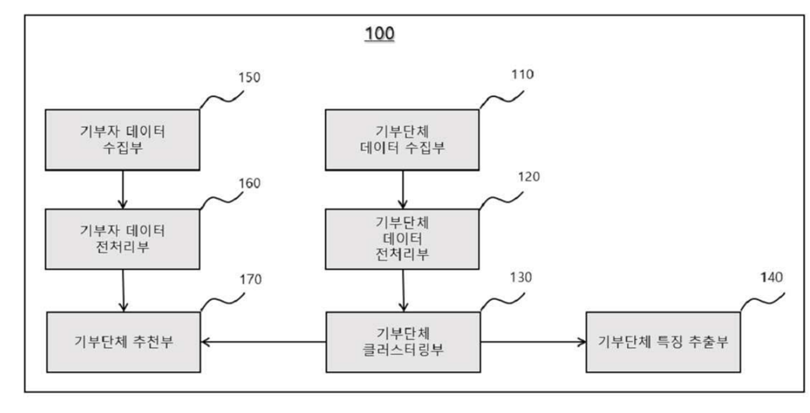
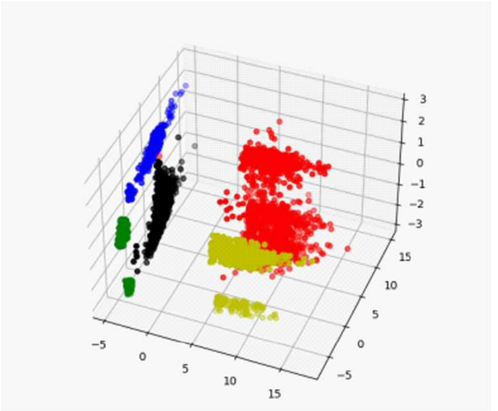

## 👼천사랭킹 AI - 취향저격 기부단체 추천 알고리즘

🏆**Patent No. 4020230231908 registered on December 20, 2023**

🏆**2023 GIST startup night**

## 📂Overview

<table>
  <tr>
    <td style="text-align:center;"></td>
    <td style="text-align:center;"></td>
  </tr>
</table>

🌐[1004-finder|천사발굴단 on *instagram*](https://www.instagram.com/1004_finder/)

### What it does

천사랭킹 AI는 기부자의 취향에 딱 맞는 기부단체를 추천해주는 AI 알고리즘입니다. 기부단체를 효과적으로 클러스터링 후, 기부자의 선호도에 맞춰 추천해주는 시스템으로 어렵게만 느껴졌던 기부를 쉽고 재밌게 만들어줍니다.

### Technology

천사랭킹 AI는 기부자의 선호를 분석하고 기부 단체를 효율적으로 클러스터링하기 위해 머신러닝 알고리즘을 사용하여, **기부의 만족감, 기부 단체의 투명성과 신뢰성을 높여 줍니다.** 

## 📂Methodology

천사랭킹 AI는 다음과 같은 기술로 구성됩니다. 

- **기부단체 데이터 수집부**: 외부 서버 또는 사용자 입력을 통해 기부단체 데이터를 수신합니다. 
- **기부단체 데이터 전처리부**: 기부단체 특징정보 중 유의미한 정보만을 추출합니다.
- **기부단체 클러스터링부**: 기부단체 클러스터 분포가 가우시안 분포를 른다고 가정, 클러스터 분포가 기부단체 분포에 가장 잘 맞을 수 있도록 fitting합니다. 기부단체들은 유사한 특징정보를 가진 클러스터로 그룹화됩니다. 
- **기부단체 클러스터링부**: 클러스터링 결과 학습된 클러스터 별 기부단체 클러스터 분포가 가우시안 분포를 른다고 가정, 클러스터 분포가 기부단체 분포에 가장 잘 맞을 수 있도록 fitting합니다. 
- **기부자 데이터 수집부**: 기부자 단말을 이용해 기부자 데이터를 수집합니다. 
- **기부단체 추천부**: K-NN 알고리즘을 이용해 응답 데이터 기준 최단 거리에 있는 기부단체 5개를 추천합니다. 

## 📂Requirement

### Dependencies

- Python 3.x
- pandas
- scikit-learn
- numpy

### Setup

1. Install Python 3.x
2. Install required packages

```
pip install pandas scikit-learn numpy
```


## 📂Implement

### Demo

1. Prepare donor and donation organization data.
2. Run the algorithm with the following command:

```
python donation_recommendation.py
```

### Screenshot






## 📂Hierarchy

```
project-root/
├── clustering.py
├── dim_reduction.py
├── features.py
├── parameters.txt
├── test.py
├── to_numpy.py
├── tree.dot
├── unsupervised-random-forest/
│   ├── __pycache__/
│   ├── notebooks/
│   │   ├── README.md
│   │   ├── sklearn_comparison.png
│   │   ├── synthetic_data.py
│   │   ├── unsupervised_random_forest.py
├── attributes.txt
├── more_than_10.txt
├── non_numeric.txt
├── numeric.txt
├── requirements.txt
├── statistics.txt
├── Result/
│   ├── 4/
│   ├── 5/
├── feature_plots/
│   ├── Discrete/
│   ├── Numeric/
├── src/
│   ├── __pycache__/
│   ├── 2021_data_analysis.py
│   ├── clustering.py
│   ├── dim_reduction.py
│   ├── features.py
│   ├── parameters.txt
│   ├── test.py
│   ├── to_numpy.py
│   ├── tree.dot
```


## 📂Contributors

- Junmyung Lee
- Jangwon Hwang
- Jaehee Lee

